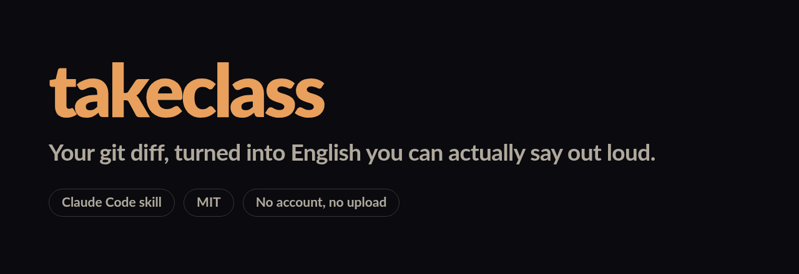
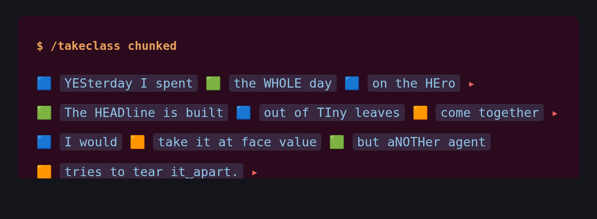
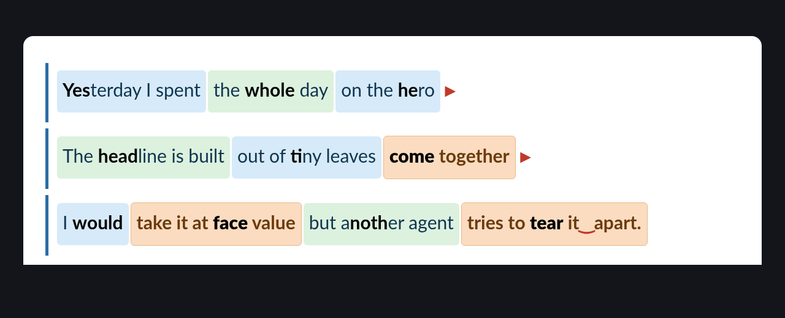

<p align="center">
  
</p>

<p align="center">
  
  
  
</p>

<p align="center">
  <b>For devs who can ship the feature but choke when they have to explain it in English.</b><br>
  Run <code>/takeclass</code> in a repo where you worked today. Claude turns your actual diff into a spoken-English workout.
</p>

<p align="center">
  <a href="#install"><b>Install</b></a> ·
  <a href="#chunking--the-script-marked-up-for-your-mouth"><b>Chunking</b></a> ·
  <a href="#usage"><b>Usage</b></a> ·
  <a href="#a-real-example"><b>Example</b></a> ·
  <a href="./ROADMAP.md"><b>Roadmap</b></a>
</p>

---

## Why this exists

Most English apps for developers give you generic dialogues about ordering coffee or booking hotels. That's not the gap.

The gap is this: you shipped the feature. You understand the code. You picked the trade-offs. But then you open your mouth in the standup, or in the code review, or on the tech talk — and it comes out flat. You reach for a word that isn't there. You default to "I changed some things" when what you did was *refactor the authentication middleware to support rotating refresh tokens*.

`takeclass` fixes that loop by practicing on the thing you already know: **today's diff**. You can't run out of material because you generate new material every day by doing your job.

---

## What it does

Each session produces four sections, tailored to your level and style:

**1. Warm-up vocabulary**
5–8 technical terms pulled from your diff — function names, domain concepts, libraries you touched — with pronunciation hints and a natural example sentence for each.

**2. A script to read aloud**
150–300 words narrating what you did today, in the register you chose (standup / PR description / tech talk / casual). Calibrated to your level: simpler sentences if you're starting, hedged and nuanced prose if you're advanced. Warm-up vocabulary bolded the first time it appears.

**3. Rephrase drills**
Three sentences from the script rewritten in two other registers (formal ↔ casual, simple ↔ advanced, active ↔ passive). The point is flexibility — saying the same idea three different ways so you can match the room.

**4. Self-check questions**
Three open prompts you answer out loud. No grading, no autocorrect. Just you talking to yourself about your own code in English: *Why did you pick this approach? What did you give up? How would you defend it in review?*

Your level, style, and recurring weak points are remembered across sessions. Every 5 classes, the difficulty nudges up.

And optionally, the script comes **marked up for your mouth** — see below.

---

## Chunking — the script, marked up for your mouth

Here's the thing nobody tells you: when you read English out loud and it comes out wrong, it's usually **not your grammar**. Your grammar is fine. Three other things give you away.

You pause wherever you run out of air, which lands mid-phrase. You stress every word equally, which is the single loudest tell of a Spanish, Italian or Portuguese speaker. And you split phrasal verbs down the middle, so `pick up` stops sounding like English even when every sound in it is correct.

A plain paragraph tells you nothing about any of that. So the script can come like this instead:

<p align="center">
  
</p>

Five marks, and not one of them is grammar:

| Mark | Means | The rule |
|---|---|---|
| 🟦 🟩 | **Breath group** | Say it in one push of air. Never stop inside one. The two colors alternate so your eye sees the seam; individually they mean nothing. |
| 🟧 | **Fixed block** | A phrasal verb or collocation. Say it as one word. If a gap creeps into the middle, you haven't learned it yet. |
| `UPPERCASE` | **The stress** | Exactly one per group. Everything else deflates. |
| `‿` | **Linking** | The consonant binds to the next vowel. `pick‿up` is *"pi-kap"*, not two words. |
| `▸` | **Pause** | The only place you're allowed to breathe. |

And one rule that matters more than all five: **if you trip, repeat the group, not the sentence.** A group is three words. Restarting the sentence is what turns a stumble into a spiral.

<p align="center">
  
  <br><em>You'll get it. It took me a podcast nobody will ever hear.</em>
</p>

### Three formats

| Command | What you get |
|---|---|
| `/takeclass chunked` | Inline, in the terminal. Nothing to install. |
| `/takeclass chunked-html` | Full color, opens in your browser, scrolls while you record. |
| `/takeclass chunked-pdf` | Printable, for a music stand or a tablet. Needs `weasyprint`. |

<p align="center">
  
  <br><em>The same three lines in <code>html</code>. Same system, real color, and stress goes back to bold because a browser can render it mid-word.</em>
</p>

HTML and PDF add two things the terminal can't fit: a table of every fixed block in the script, and a 90-second drill to run before you read.

The table respells each block in **your own language** rather than IPA. A Spanish speaker reads *"pi-kap"* correctly on sight and needs a lookup table for /pɪk ʌp/. The goal is a mouth that moves, not phonetic literacy.

### You're asked once

The first run picks your format alongside your level and style, and never asks again. The default is `none`, a plain class, because chunking is for the days you actually intend to read out loud and marks on a script you're skimming are just noise.

Change it whenever by saying so: *"switch chunking to html"*. The `chunked*` args are one-offs and don't touch the saved setting, so trying a format costs nothing.

<details>
<summary><b>Why colored squares instead of real terminal color</b></summary>

<br>

Because real terminal color isn't available here, and that took two experiments to establish rather than assume.

**ANSI escape sequences get sanitized** by Claude Code, in both bash output and model output. They arrive as literal `[46;30m` bracket noise. It's a known upstream limitation with open issues ([#18728](https://github.com/anthropics/claude-code/issues/18728), [#16668](https://github.com/anthropics/claude-code/issues/16668)) — a `terminal.preserveAnsiCodes` setting has been requested and not shipped.

**A fenced `diff` block** does get syntax highlighted, but it gives text color rather than backgrounds, offers only two usable colors and no third one for fixed blocks, and kills markdown inside the fence.

Colored emoji sidestep the whole problem, because they're **glyphs**: the color lives in the font. Any terminal, any theme, and they survive being pasted into a note. Each group is also wrapped in backticks, which is the one inline construct the renderer tints, so the words themselves get color and a background and a group reads as a block instead of a run of words.

One more thing this fixes, learned by shipping it broken: stress is marked with capitals rather than bold because it lands on a **syllable**, and `**Yes**terday` is not something a terminal renders. Worse, the unclosed `**` desyncs the parser for the rest of the line, so well-formed bold further along breaks too.

If `preserveAnsiCodes` ever lands, real backgrounds become possible and this is worth revisiting. Until then, squares.

</details>

---

## Install

Requires [Claude Code](https://claude.com/claude-code).

```bash
git clone https://github.com/BraianTroncoso/takeclass.git ~/dev-own/takeclass
bash ~/dev-own/takeclass/scripts/install.sh
```

The installer creates two symlinks inside `~/.claude/`:

- `~/.claude/skills/dev-english-practice` → `<repo>/skills/dev-english-practice`
- `~/.claude/commands/takeclass.md` → `<repo>/commands/takeclass.md`

Editing the skill in the repo updates what Claude sees live — no reinstall needed.

To uninstall:

```bash
bash ~/dev-own/takeclass/scripts/uninstall.sh
```

Only symlinks that point back to this repo are removed; the rest of your Claude config stays untouched.

---

## Usage

Inside Claude Code, from any git repo where you worked today:

```
/takeclass
```

First run asks for your level and style, saves them, and generates your class. Subsequent runs skip the setup.

Skip the setup from the start with args:

```
/takeclass advanced tech-talk
```

Valid levels: `beginner` · `intermediate` · `advanced`
Valid styles: `standup` · `pr-description` · `tech-talk` · `casual-explain`
Valid chunking: `chunked` · `chunked-html` · `chunked-pdf`

Order is flexible, so `/takeclass chunked-pdf standup` works. Chunking args are one-offs; they don't change your saved setting.

You can also trigger it in plain language:

> *"take an English class on what I did today"*
> *"let me practice a standup in English"*
> *"I want to rehearse explaining this refactor"*

---

## A real example

```
📚 English class — session #3 — intermediate / standup — 2026-04-17

### 1. Warm-up vocabulary
- middleware /ˈmɪd.əl.wer/ — software that sits between layers.
  Example: I updated the auth middleware this morning.
- refactor /ˌriːˈfæk.tər/ — to restructure code without changing behavior.
  Example: I had to refactor the token handler.
- edge case /ˈɛdʒ keɪs/ — an unusual input or condition.
  Example: We missed an edge case when the token is empty.

### 2. Script to read aloud
Yesterday I worked on the refactor of the auth middleware. The goal was to
support refresh tokens without breaking existing flows. I moved the refresh
logic into its own helper so the middleware stays thin. Along the way I caught
an edge case: when the incoming token is valid but expired by less than a
second, the old code rejected it. I added a small buffer window and a test
that covers it. Today I'm going to wire the helper into the session endpoint
and open the PR. Blockers: none, though I want a second pair of eyes on the
buffer value before we ship.

### 3. Rephrase drill
- "I moved the refresh logic into its own helper."
  → Formal: "The refresh logic was extracted into a dedicated helper."
  → Casual: "I pulled the refresh logic out into a helper."
...

### 4. Self-check questions
1. Why did you add a buffer window instead of rejecting the token outright?
2. What trade-off comes with making the buffer configurable later?
3. If a reviewer said "this buffer hides bugs", how would you defend it?

💡 When you finish reading aloud, tell me which words tripped you up — I'll log
them for next time.
```

And the same script with `chunked` turned on:

<pre>
🟦 `YESterday I worked on` 🟩 `the reFACtor` 🟦 `of the auth MIDdleware.` ▸

🟦 `The GOAL was` 🟧 `to support` 🟩 `reFRESH tokens` 🟦 `without BREAKing` 🟩 `exISTing flows.` ▸

🟦 `Along the WAY` 🟧 `I caught` 🟩 `an EDGE case` ▸ 🟦 `the token was vaLID` 🟩 `but exPIRED` 🟧 `by less than a second.`
</pre>

Same words. The difference is that now you know where to breathe.

---

## Fallbacks and safeguards

- **Not in a git repo?** The skill asks you to summarize your day in 1–2 sentences and builds the class from that.
- **No commits today?** Same fallback.
- **Huge diff?** Summarized by file so the class stays focused on the important parts.
- **Secrets in your diff?** Anything that looks like a token, password, or `.env` value is stripped before it gets used as class material.
- **Diff is noise (formatters, auto-imports)?** Logic changes are prioritized over formatting-only changes.

---

## Roadmap

See [ROADMAP.md](./ROADMAP.md) for the detailed specs. In short:

- **v0.2 — Mirror mode.** Invert the flow: you narrate first, Claude returns a polished version with a diff of what changed and why. Active learning, not passive reading.
- **v0.3 — Streak + weekly recap.** Daily streak counter on every class, plus a separate `/takeclass-recap` command that summarizes the week — sessions, vocabulary learned, top weak points, next week's focus.
- **v0.4 — Chunked reading.** The script marked up with breath groups, stress, phrasal-verb blocks, linking and pauses. Inline, HTML or PDF.
- **v0.5 — Voice loop.** Read the script aloud, Claude hears you, flags pronunciation and filler words. Bring your own STT (OS dictation, Whisper, etc.).
- **v0.6 — MCP server.** Decouple the logic so any MCP client can host the class, not just Claude Code.
- **v0.7 — Progression engine.** Spaced-repetition for weak words, automatic difficulty curve, vocabulary deck.
- **v0.8+** — interview-practice mode, team mode, Linear/Jira integration, persona mode.

---

## Contributing

PRs welcome. Good first contributions:

- New styles (e.g. `interview-practice`, `sprint-review`, `architecture-review`).
- Better phonetic hints for common Spanish-speaker pain points.
- Example outputs for levels that aren't well-represented yet.
- Translations of the teaching scaffolding (the *target* language stays English; the scaffolding around it can localize).

Open an issue first for bigger changes so we can align on direction.

---

## License

MIT — see [LICENSE](./LICENSE).

---

